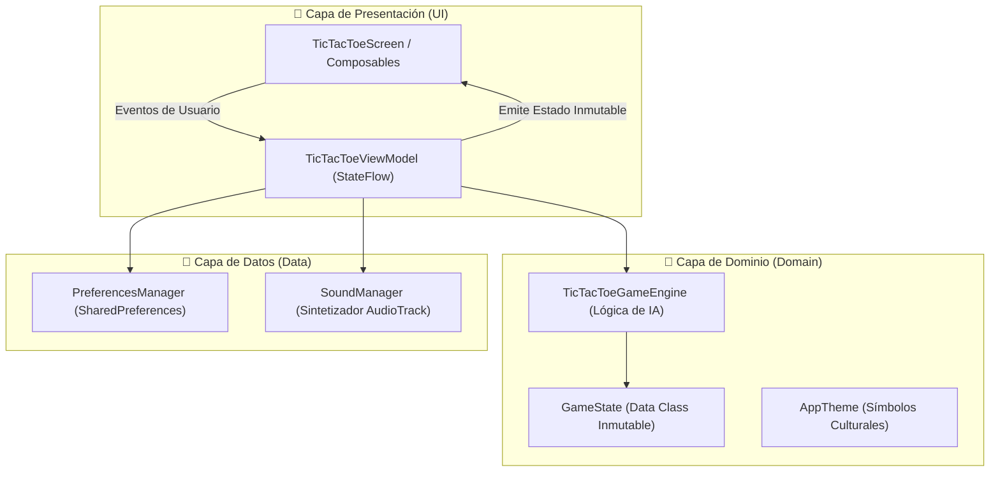
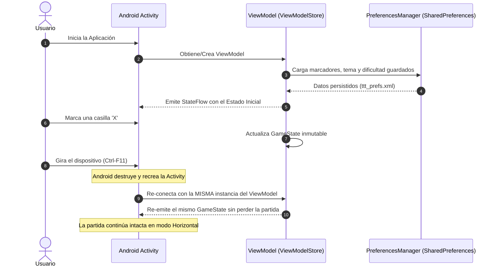
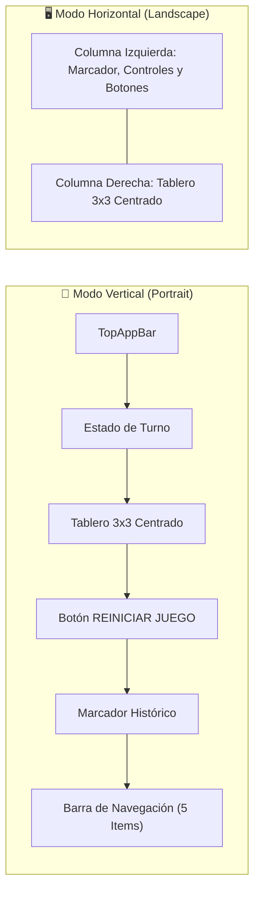

# 🎮 Tres en Raya (Tic-Tac-Toe) - Reto 6: Guía Didáctica y Manual de Estudio

[](https://developer.android.com/studio)
[](https://kotlinlang.org/)
[](https://developer.android.com/jetpack/compose)
[](#)

Bienvenido a la guía académica y repositorio del **Reto 6: Tres en Raya (Tic-Tac-Toe)**. Este proyecto está diseñado minuciosamente como un **recurso de estudio paso a paso** para estudiantes y desarrolladores de aplicaciones móviles en Android.

---

## 📐 1. Diagrama de Arquitectura (MVVM + Clean Architecture)

El proyecto sigue una arquitectura desacoplada y reactiva en 3 capas fundamentales:



---

## 🔄 2. Ciclo de Vida y Gestión de Rotación de Pantalla (Reto 6)

El objetivo central del **Reto 6** es resolver el problema del reinicio de la `Activity` al girar el dispositivo (Portrait $\leftrightarrow$ Landscape).



> [!IMPORTANT]
> **¿Por qué el ViewModel sobrevive a la rotación?**
> Cuando ocurre un cambio de configuración (como girar la pantalla), Android destruye la instancia visual de la `Activity`. Sin embargo, el `ViewModelStore` conserva la instancia del `ViewModel` en memoria. Al recrearse la nueva `Activity`, se re-conecta al mismo `ViewModel`, conservando intactos el tablero, marcadores y turno activo.

---

## 📱 3. Adaptación Responsiva (Portrait vs. Landscape)



---

## 📑 4. Conceptos Clave para Estudiar

| Concepto Técnico | Descripción Académica | Ubicación en el Código |
| :--- | :--- | :--- |
| **StateFlow & UI Inmutable** | Flujo reactivo que emite `GameState` garantizando que la UI se redibuje de manera eficiente. | [`TicTacToeViewModel.kt`](file:///C:/Users/JesúsEnriqueFloresRi/AndroidStudioProjects/MyApplication2/app/src/main/java/com/example/myapplication/ui/TicTacToeViewModel.kt) |
| **Persistencia Local** | Uso de `SharedPreferences` en el archivo `"ttt_prefs.xml"` para guardar marcadores y configuraciones entre inicios. | [`PreferencesManager.kt`](file:///C:/Users/JesúsEnriqueFloresRi/AndroidStudioProjects/MyApplication2/app/src/main/java/com/example/myapplication/data/PreferencesManager.kt) |
| **Efectos de Audio por Tema** | Sintetizador de audio nativo mediante `AudioTrack` que ajusta tonos según el tema seleccionado. | [`SoundManager.kt`](file:///C:/Users/JesúsEnriqueFloresRi/AndroidStudioProjects/MyApplication2/app/src/main/java/com/example/myapplication/audio/SoundManager.kt) |
| **Niveles de Inteligencia Artificial** | Implementación de algoritmos heurísticos para los niveles `Easy`, `Harder` y `Expert`. | [`TicTacToeGameEngine.kt`](file:///C:/Users/JesúsEnriqueFloresRi/AndroidStudioProjects/MyApplication2/app/src/main/java/com/example/myapplication/domain/TicTacToeGameEngine.kt) |
| **Temas Culturales de Fichas** | Soporte para símbolos temáticos (`Clásico`, `Costa`, `Llanos`, `Vaquero Country`). | [`AppTheme.kt`](file:///C:/Users/JesúsEnriqueFloresRi/AndroidStudioProjects/MyApplication2/app/src/main/java/com/example/myapplication/domain/AppTheme.kt) |

---

## 🎨 5. Temas Culturales Incluidos

> [!TIP]
> Puedes cambiar el tema visual en cualquier momento desde la pestaña **Tema** de la barra inferior:

1. **Clásico:** Fichas tradicionales (`X` vs `O`).
2. **Costa:** Símbolos marinos (`🐚` vs `⭐`).
3. **Llanos:** Símbolos folclóricos (`🐓` vs `🪇`).
4. **Vaquero Country:** Símbolos vaqueros (`🤠` vs `🐎`).

---

## 🛠️ 6. Guía de Ejecución e Instalación

### Compilar desde Terminal:
```bash
./gradlew assembleDebug
```

### Instalar en Emulador conectado por ADB:
```bash
adb install -r apk/Reto6-Triqui.apk
adb shell am start -n com.example.myapplication/.MainActivity
```

---

## 👤 Autor e Información del Proyecto

- **Desarrollado por:** Jesús Enrique Flores Riera
- **Materia:** Desarrollo de Aplicaciones para Dispositivos Móviles
- **Repositorio:** [https://github.com/jf-floresriera/Reto6](https://github.com/jf-floresriera/Reto6)
- **APK Ejecutable:** [apk/Reto6-Triqui.apk](file:///C:/Users/JesúsEnriqueFloresRi/AndroidStudioProjects/MyApplication2/apk/Reto6-Triqui.apk)
